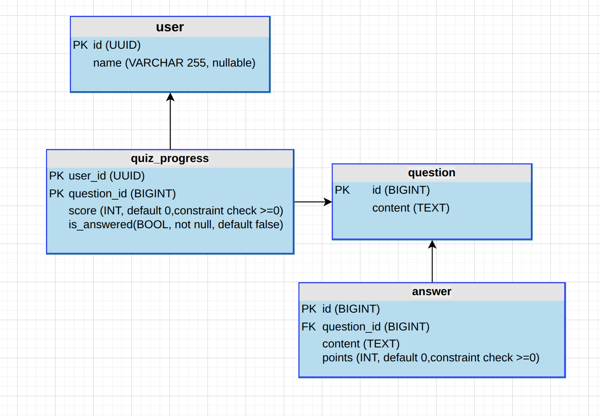

# 365scores quiz app

- [Frontend docs](packages/frontend/README.md)
- [Backend docs](packages/backend/README.md)


# Getting Started
- install [Bun](https://bun.com/get)
- install [Docker](https://docs.docker.com/engine/install/)

To run this application on local machine:

```bash
# install depends
bun install

# run postgres and pgweb inside docker container
# pgweb will be available on http://127.0.0.1:8081/
bun run db:start

# run schema migrations for backend
cd packages/backend/
bunx drizzle-kit push
bun run seed content

# run local frontend and backend dev server on host machine
# frontend will be available on http://127.0.0.1:3000/
bun run dev

# if you want to prune database
bun run db:destroy
```

## Demo


{:target="_blank"}
